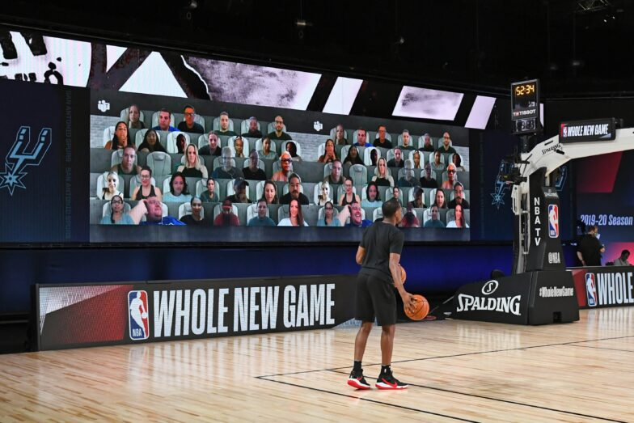
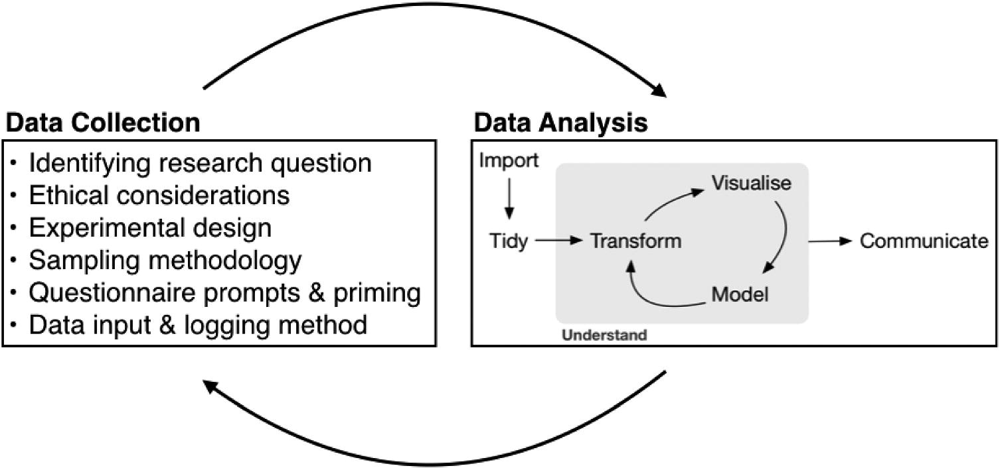

### Welcome!

.center[

]

.large[
- Dr. Ciaran Evans
- Manchester 329
- Course website: [https://sta112-s26.github.io/](https://sta112-s26.github.io/)
]

.footnote[
Illustration: Updated from Grolemund & Wickham's classis R4DS schematic, envisioned by Dr. Julia Lowndes for her 2019 useR! keynote talk and illustrated by Allison Horst.
]

---

### Agenda

.large[
* Activity: getting to know each other, and how do fans impact NBA games?
* Plan for week 1
* Syllabus highlights
]

---

### Class activity

.center[

]

.large[
* Work in small groups to answer the activity questions (handout)
* We'll reconvene to discuss in 15--20 minutes
* I will collect your work at the end of class (part of class participation grade)
]

.footnote[
Image: NBA.com
]

---

### Research question

.large[
What specific question were the researchers trying to answer?
]

---

### Research question

.large[
What specific question were the researchers trying to answer?
]

.large[
* Do home teams perform better when they have more fans present?
]

---

### Data

.large[
To answer their research question, the authors gathered data on NBA games. Where did the data come from? Were there any issues with the data?
]

---

### Data

.large[
To answer their research question, the authors gathered data on NBA games. Where did the data come from? Were there any issues with the data?
]

.large[
* Results and attendances downloaded from [Basketball-Reference.com](https://www.basketball-reference.com/)
* Attendance data also collected from NBA and local news
]

---

### Data

.large[
To answer their research question, the authors gathered data on NBA games. Where did the data come from? Were there any issues with the data?
]

.large[
* Results and attendances downloaded from [Basketball-Reference.com](https://www.basketball-reference.com/)
* Attendance data also collected from NBA and local news
]

.large[
.question[
Issue: reported attendance sometimes inaccurate!
]
]

---

### Methods

.large[
What statistics and data science tools did the researchers use to come to their conclusions?
]

---

### Methods

.large[
What statistics and data science tools did the researchers use to come to their conclusions?
]

.large[
* Linear regression model
    - Includes other potential factors that could influence outcome of game
* Hypothesis tests for strength of the relationship
]

---

### Conclusions

.large[
What did the researchers conclude about their research question?
]

---

### Conclusions

.large[
What did the researchers conclude about their research question?
]

.large[
* An increase of 1,000 home fans is associated with an increase of 1.4 points in the home team's margin of victory, after controlling for other factors
* So, home teams tend to perform better when they have more fans
* Is there anything you would do differently?
]

---

### Reproducibility

.large[
.question[
Could you reproduce their results?
]
]

---

### Reproducibility

.large[
.question[
Could you reproduce their results?
]
]

.large[
Possibly, but it would be hard.
* Data doesn't seem to be available (we would have to collect it ourselves)
* Code for analysis not available
]

---

### Components of (good) data analysis

.center[

]

.large[
* Defining a clear research question
* Collecting data that can answer your question
* Data preparation: exploring, cleaning, transforming
* Investigating question with figures, tables, models
* Communicating results
* Sharing data and code to make work reproducible
]

.footnote[
Source: Albert Y. Kim & Johanna Hardin (2021) “Playing the Whole Game”: A Data Collection and Analysis Exercise With Google Calendar, Journal of Statistics and Data Science Education, 29:sup1, S51-S60, DOI: 10.1080/10691898.2020.1799728
]

---

### Plan for Week 1

.large[
* Download R and RStudio today or tomorrow
    - Instructions on course website
    - Please contact me if you have problems!
* Bring laptop to class from now on
* HW 1 released, due next Friday
]

---

### Expectations

.large[
* Complete any assigned reading ahead of class
* Bring laptop each day
* Submit class activities (graded for effort, not completeness or correctness)
]

---

### Course components

.large[
* Class participation (graded for effort)
* HW assignments (roughly one per week)
* Exams (2 midterms, 1 final)
* Project
]

---

### AI policy

.large[
* I will *never* use AI to grade your work; all feedback you receive will be directly from me and the TA
* Collaboration with other students, and AI assistance, is permitted on homework
    * Assistance does *not* mean uploading the assignment to ChatGPT and copying the answers
    * You must cite collaborators and external resources
* See syllabus for further details
]

---

### For next time

.large[
* Make sure R and RStudio are installed
* Instructions are provided on the course website
]