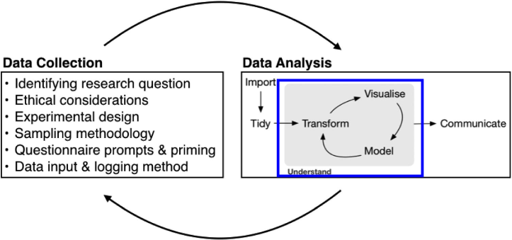
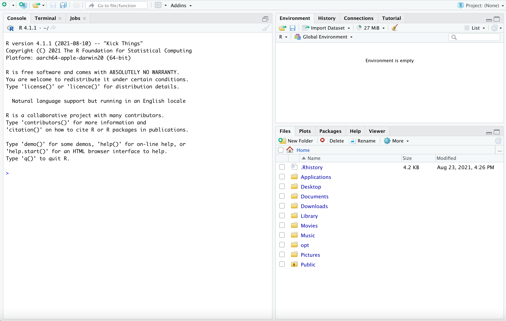
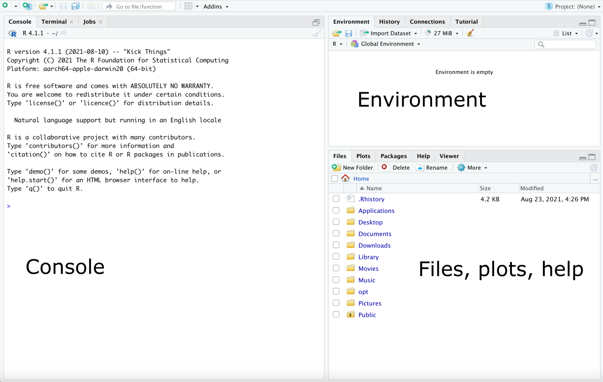
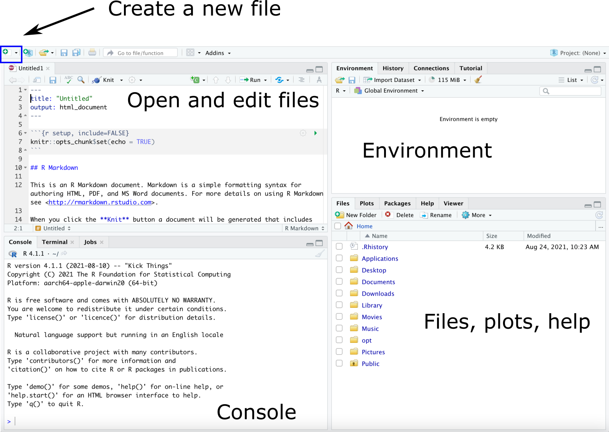

### Agenda

.large[
* Overview of exploratory data analysis
* Introduction to R and RStudio
* Class activity: penguins!
]

---

### The data analysis process

.center[

]

---

### The data analysis process

.center[

]

---

### The data analysis process

.center[

]

.large[
*Understanding*:
* Not a linear process
* Begins with *exploratory data analysis*
]

---

### Exploratory data analysis (EDA)

.center[

]

.large[
Goal: get familiar with the data

* What does the data represent?
    * How big is the data?
    * What are the rows and columns?
    * Where and when was it collected?
    * Who collected it, and what choices did they make?
    * Etc.
]

---

### Exploratory data analysis (EDA)

.center[

]

.large[
Goal: get familiar with the data

* What do the variables look like? (univariate EDA)
    * histograms, frequency tables, summary statistics, etc.
    * any outliers?
]
    
---

### Exploratory data analysis (EDA)

.center[

]

.large[
Goal: get familiar with the data

* How are the variables related? (multivariate EDA)
    * two-way tables, scatterplots, boxplots, etc.
]
    
---
    
### Exploratory data analysis (EDA)

.center[

]

.large[
Goal: get familiar with the data

* What relationships might we want to model?
    * generally informed by *why* we're looking at the data
]
    
---

### Data: Penguins!

.large[
Data on 344 penguins from 3 species (Adelie, Chinstrap, Gentoo). Variables include

* Species
* Bill length
* Bill depth
* ...
]

.center[

]

.footnote[
Artwork by @allison_horst
]

---

### Visualizations

.large[
*Bill length* is a quantitative variable. What plot could we use to visualize the distribution of bill length in the penguins dataset?

.abox[ 
(A) Scatterplot
]

.bbox[
(B) Histogram
]

.cbox[
(C) Bar chart
]

.dbox[
(D) Pie chart
]
]

---

### Visualizations

.large[
*Bill length* is a quantitative variable. What plot could we use to visualize the distribution of bill length in the penguins dataset?

.abox[ 
(A) Scatterplot
]

.bbox[
(B) Histogram
]

.cbox[
(C) Bar chart
]

.dbox[
(D) Pie chart
]
]

.large[
**Answer:** A histogram is a good choice for visualizing the distribution of a single quantitative variable.
]

---

### Visualizations

.large[
*Species* is a categorical variable. What plot could we use to visualize the distribution of species in the penguins dataset?

.abox[ 
(A) Scatterplot
]

.bbox[
(B) Histogram
]

.cbox[
(C) Bar chart
]

.dbox[
(D) Pie chart
]
]

---

### Visualizations

.large[
*Species* is a categorical variable. What plot could we use to visualize the distribution of species in the penguins dataset?

.abox[ 
(A) Scatterplot
]

.bbox[
(B) Histogram
]

.cbox[
(C) Bar chart
]

.dbox[
(D) Pie chart
]
]

.large[
**Answer:** A bar chart is a good choice for visualizing the distribution of a single categorical variable. Pie charts also work, but I find them harder to read.
]

---

### Visualizations

.large[
*Bill length* and *bill depth* are both quantitative variables. What plot could we use to visualize the relationship between these two variables?

.abox[ 
(A) Scatterplot
]

.bbox[
(B) Histogram
]

.cbox[
(C) Bar chart
]

.dbox[
(D) Pie chart
]
]

---

### Visualizations

.large[
*Bill length* and *bill depth* are both quantitative variables. What plot could we use to visualize the relationship between these two variables?

.abox[ 
(A) Scatterplot
]

.bbox[
(B) Histogram
]

.cbox[
(C) Bar chart
]

.dbox[
(D) Pie chart
]
]

.large[
**Answer:** A scatterplot shows the relationship between two quantitative variables.
]

---

### Tools for working with data

.large[
**R:** Statistical software for data manipulation, visualization, computing, modeling

**RStudio:** Integrated development environment (IDE) that makes it easy to use R
]

.center[

]

.footnote[
Source: [Modern Dive](https://moderndive.com/index.html)
]

---

### Overview of RStudio

.center[

]

---

### Panes

.center[

]

---

### Panes

.center[

]

---

### Class activity: EDA with penguins

.large[
[https://sta112-s26.github.io/class_activities/ca_02.html](https://sta112-s26.github.io/class_activities/ca_02.html)
]

.center[

]

.footnote[
Artwork by @allison_horst
]

---

```{r setup, include=FALSE}
knitr::opts_chunk$set(echo = TRUE, warning=F, message=F)
library(palmerpenguins)
library(tidyverse)
```

### Distribution of bill length

.large[
```{r, fig.width = 8, fig.height=5}
penguins |>
  ggplot(aes(x = bill_length_mm)) +
  geom_histogram()
```
]

---

### Distribution of bill length

```{r, fig.width = 8, fig.height=5, echo=F}
penguins |>
  ggplot(aes(x = bill_length_mm)) +
  geom_histogram()
```

.large[
* Most bill lengths between 35mm and 55mm
* Multimodal, with peaks around 40mm, 45mm, and 50mm
* Fairly symmetric, no clear outliers
]

---

### Aside: changing the number of bins

.large[
```{r, fig.show='hide'}
penguins |>
  ggplot(aes(x = bill_length_mm)) +
  geom_histogram(bins = 20)
```

When making histograms, it is good to try different numbers of bins. The default in `geom_histogram` is 30, but can be changed with `bins = ...`
]

---

### Bill depth vs. bill length

.large[
```{r, fig.width = 6, fig.height = 4}
penguins |>
  ggplot(aes(x = bill_length_mm, 
             y = bill_depth_mm)) +
  geom_point()
```
]

---

### Bill depth vs. bill length

.large[
```{r, fig.width = 7, fig.height = 5, echo = F}
penguins |>
  ggplot(aes(x = bill_length_mm, 
             y = bill_depth_mm)) +
  geom_point()
```

* There does not appear to be a relationship between bill length and bill depth
]

---

### Coloring by species

```{r, fig.width = 7, fig.height = 4}
penguins |>
  ggplot(aes(x = bill_length_mm, 
             y = bill_depth_mm, 
             color = species, shape=species)) +
  geom_point()
```

---

### Coloring by species

```{r, fig.width = 7, fig.height = 4}
penguins |>
  ggplot(aes(x = bill_length_mm, 
             y = bill_depth_mm, 
             color = species, shape=species)) +
  geom_point()
```

.large[
Within each species, there appears to be a positive, linear relationship between bill length and bill depth.
]

---

### Predicting species

```{r, fig.width = 7, fig.height = 5, echo=F, fig.align='center'}
penguins |>
  ggplot(aes(x = bill_length_mm, 
             y = bill_depth_mm, 
             color = species, shape=species)) +
  geom_point(size=1.5) +
  theme(text = element_text(size = 20))
```

.large[
New penguin 🐧:
* Bill length = 50mm, bill depth = 15mm
* Predicted species = ?
]
