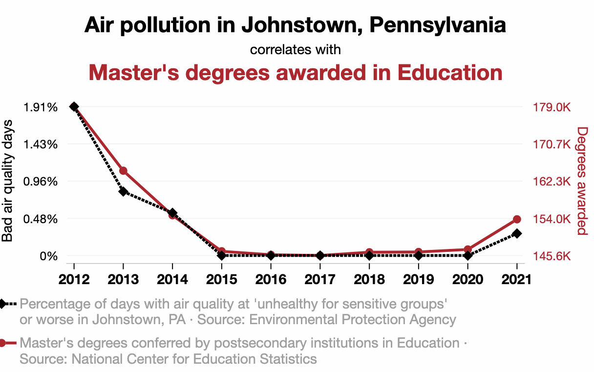

### Agenda

.large[
* Today: 
    * Statistical communication exercise
    * prediction and correlation
* Other:
    * Project Part 1 released, due next Friday
    * Don't wait too late to try loading data into R!
        * See me if you have any issues
]

---

### Statistical communication exercise

.large[
You are a statistical consultant, and a client reaches out to you to ask about some data they have collected. You fit a linear model, and the client has a question for you.

Spend ~5 minutes, individually, writing a brief email to the client to answer their question. Then we will discuss as a class.
]

---

### Last time: SSE

.large[
.center[
$SSE = \sum_{i=1}^n (y_i - \widehat{y}_i)^2$
]
]

```{r, echo=F, message=F, warning=F, fig.width=10, fig.height=4}
library(Stat2Data)
data("GrinnellHouses")
library(gridExtra)
library(tidyverse)

p1 <- GrinnellHouses |>
  filter(YearBuilt > 1900) |>
  ggplot(aes(x = YearBuilt, y = SalePrice)) +
  geom_point() +
  geom_smooth(se=F, method = "lm") +
  theme_bw() +
  theme(text = element_text(size = 20)) +
  labs(x = "Year built",
       y = "Sale price ($)")

p2 <- GrinnellHouses |>
  filter(YearBuilt > 1900) |>
  ggplot(aes(x = SquareFeet, y = SalePrice)) +
  geom_point() +
  geom_smooth(se=F, method = "lm") +
  theme_bw() +
  theme(text = element_text(size = 20)) +
  labs(x = "House size (square feet)",
       y = "Sale price ($)")

grid.arrange(p1, p2, ncol = 2)
```

.pull-left[
.large[
SSE: $3.41 \times 10^{12}$
]
]

.pull-right[
.large[
SSE: $1.74 \times 10^{12}$
]
]

.large[
These numbers are very large!
]

---

### Last time: SSE

.large[
.center[
$SSE = \sum_{i=1}^n (y_i - \widehat{y}_i)^2$
]
]

.large[
* Depends on the scale of the response variable
* Depends on the *number* of observations
* Depends on the strength of the relationship
]


---

### Alternative: RMSE

.pull-left[
.large[
.center[
$SSE = \sum_{i=1}^n (y_i - \widehat{y}_i)^2$
]

* Depends on the scale of the response variable
* Depends on the *number* of observations
* Depends on the strength of the relationship
]
]

.pull-right[
.large[
.center[
$RMSE = \sqrt{\frac{1}{n} \sum_{i=1}^n (y_i - \widehat{y}_i)^2}$
]

* Depends on the scale of the response variable
* Depends on the strength of the relationship
* Does *not* depend on the number of observations
]
]

---

### Root mean square error (RMSE)

.large[
.center[
$RMSE = \sqrt{\frac{1}{n} \sum_{i=1}^n (y_i - \widehat{y}_i)^2}$
]
]

```{r, echo=F, message=F, warning=F, fig.width=10, fig.height=4}
library(Stat2Data)
data("GrinnellHouses")
library(gridExtra)
library(tidyverse)

p1 <- GrinnellHouses |>
  filter(YearBuilt > 1900) |>
  ggplot(aes(x = YearBuilt, y = SalePrice)) +
  geom_point() +
  geom_smooth(se=F, method = "lm") +
  theme_bw() +
  theme(text = element_text(size = 20)) +
  labs(x = "Year built",
       y = "Sale price ($)")

p2 <- GrinnellHouses |>
  filter(YearBuilt > 1900) |>
  ggplot(aes(x = SquareFeet, y = SalePrice)) +
  geom_point() +
  geom_smooth(se=F, method = "lm") +
  theme_bw() +
  theme(text = element_text(size = 20)) +
  labs(x = "House size (square feet)",
       y = "Sale price ($)")

grid.arrange(p1, p2, ncol = 2)
```

.pull-left[
.large[
RMSE: $73121$
]
]

.pull-right[
.large[
RMSE: $52745$
]
]

---

### Root mean square error (RMSE)

```{r, echo=F, message=F, warning=F, fig.width=10, fig.height=4}
library(Stat2Data)
data("GrinnellHouses")
library(gridExtra)
library(tidyverse)

p1 <- GrinnellHouses |>
  filter(YearBuilt > 1900) |>
  ggplot(aes(x = YearBuilt, y = SalePrice)) +
  geom_point() +
  geom_smooth(se=F, method = "lm") +
  theme_bw() +
  theme(text = element_text(size = 20)) +
  labs(x = "Year built",
       y = "Sale price ($)")

p2 <- GrinnellHouses |>
  filter(YearBuilt > 1900) |>
  ggplot(aes(x = SquareFeet, y = SalePrice)) +
  geom_point() +
  geom_smooth(se=F, method = "lm") +
  theme_bw() +
  theme(text = element_text(size = 20)) +
  labs(x = "House size (square feet)",
       y = "Sale price ($)")

grid.arrange(p1, p2, ncol = 2)
```


.large[
.question[
* Both SSE and RMSE are useful for summarizing our ability to make predictions
* Both depend on the scale of the response variable

Is there a measure of the strength of a linear relationship that does *not* depend on scale?
]
]

---

### Correlation

```{r, echo=F, message=F, warning=F, fig.width=10, fig.height=4}
library(Stat2Data)
data("GrinnellHouses")
library(gridExtra)
library(tidyverse)

p1 <- GrinnellHouses |>
  filter(YearBuilt > 1900) |>
  ggplot(aes(x = YearBuilt, y = SalePrice)) +
  geom_point() +
  geom_smooth(se=F, method = "lm") +
  theme_bw() +
  theme(text = element_text(size = 20)) +
  labs(x = "Year built",
       y = "Sale price ($)")

p2 <- GrinnellHouses |>
  filter(YearBuilt > 1900) |>
  ggplot(aes(x = SquareFeet, y = SalePrice)) +
  geom_point() +
  geom_smooth(se=F, method = "lm") +
  theme_bw() +
  theme(text = element_text(size = 20)) +
  labs(x = "House size (square feet)",
       y = "Sale price ($)")

grid.arrange(p1, p2, ncol = 2)
```

.pull-left[
.large[
Correlation: 0.41
]
]

.pull-right[
.large[
Correlation: 0.75
]
]

.large[
.question[
What is the possible range of values for a correlation?
]
]

---

### Correlation

.large[
Observe points $(x_1, y_1),...,(x_n, y_n)$

```{r, echo=F, fig.align='center', fig.width=5, fig.height=3.5}
set.seed(4)
x <- rnorm(100)
y <- x + rnorm(100)
#cor(x, y)

data.frame(x = x, y = y) |>
  ggplot(aes(x = x, y = y)) +
  geom_point() +
  theme_bw() +
  theme(text = element_text(size = 20))
```

$$r = \dfrac{\sum \limits_{i=1}^n (x_i - \overline{x})(y_i - \overline{y})}{\sqrt{\sum \limits_{i=1}^n (x_i - \overline{x})^2} \sqrt{\sum \limits_{i=1}^n (y_i - \overline{y})^2}}$$
]

---

### Correlation

.pull-left[
```{r echo=F, fig.align='center', fig.width=5, fig.height=4}
set.seed(4)
x <- rnorm(100)
y <- x + rnorm(100)
#cor(x, y)

data.frame(x = x, y = y) |>
  ggplot(aes(x = x, y = y)) +
  geom_point() +
  theme_bw()
```

.large[
.question[
What would you estimate as the correlation for this data?
]
]
]

.pull-right[
.large[
.abox[
(A) 0.2
]

.bbox[
(B) -0.2
]

.cbox[
(C) 0.6
]

.dbox[
(D) 0.9
]
]
]

---

### Correlation

.pull-left[
```{r echo=F, fig.align='center', fig.width=5, fig.height=4}
set.seed(4)
x <- rnorm(100)
y <- -x + rnorm(100, sd = 6)
#cor(x, y)

data.frame(x = x, y = y) |>
  ggplot(aes(x = x, y = y)) +
  geom_point() +
  theme_bw()
```

.large[
.question[
What would you estimate as the correlation for this data?
]
]
]

.pull-right[
.large[
.abox[
(A) 0
]

.bbox[
(B) -0.28
]

.cbox[
(C) 0.28
]

.dbox[
(D) -0.6
]
]
]


---

### Correlation

.large[
.question[
Which of these plots shows the highest correlation?
]
]

```{r, echo=F, message = F, fig.width=6, fig.height=6, fig.align='center'}
library(datasets)

p1 <- anscombe |>
  ggplot(aes(x = x1, y = y1)) +
  geom_point() +
  geom_smooth(se = F, col="lightblue",
              method = "lm") +
  theme_bw()

p2 <- anscombe |>
  ggplot(aes(x = x2, y = y2)) +
  geom_point() +
  geom_smooth(se = F, col="lightblue",
              method = "lm") +
  theme_bw()

p3 <- anscombe |>
  ggplot(aes(x = x3, y = y3)) +
  geom_point() +
  geom_smooth(se = F, col="lightblue",
              method = "lm") +
  theme_bw()

p4 <- anscombe |>
  ggplot(aes(x = x4, y = y4)) +
  geom_point() +
  geom_smooth(se = F, col="lightblue",
              method = "lm") +
  theme_bw()

grid.arrange(p1, p2, p3, p4, ncol=2)
```

---

### Prediction and correlation

* SSE:
    * depends on strength of the relationship
    * depends on number of observations
    * depends on scale of the response
* RMSE:
    * depends on strength of the relationship
    * depends on scale of the response
* Correlation:
    * depends on strength of the relationship
    * values always between [-1, 1]
    * measures strength of a **linear** relationship -- may not be suitable for nonlinear relationships
    * influenced by outliers and extreme points
    
---

### Correlation?


.question[
What is going on in this plot? Do you think this correlation is meaningful?
]




r = 0.989

---

### Activity: spurious correlations

.large[
[https://sta112-s26.github.io/class_activities/ca_07.html](https://sta112-s26.github.io/class_activities/ca_07.html)
]

.large[
* Play around with spurious correlations!
* No need to submit anything for this activity
]

