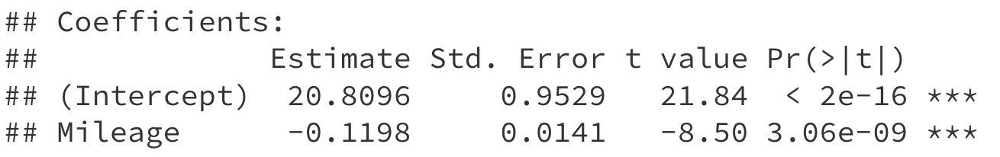
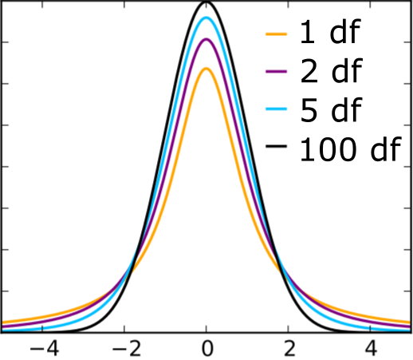
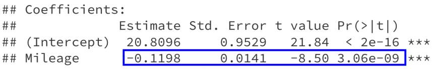

### Inference

.large[
Is there a relationship between mileage and price for used Honda Accords?
]

```{r echo=F, message=F, warning=F, fig.align='center', fig.width=6, fig.height=4}
library(tidyverse)
library(Stat2Data)
data("AccordPrice")

AccordPrice %>%
  ggplot(aes(x = Mileage, y = Price)) +
  geom_point(size = 2.5) +
  labs(x = "Miles (in 1000's)",
       y = "Price (in $1000's)") +
  theme_bw() +
  theme(text = element_text(size = 25))
```

.large[
It looks like it, but is that just a fluke?
]

---

### Is the observed relationship a fluke?

.large[
What if the population scatterplot looks like this?
]

```{r echo=F, message=F, warning=F, fig.align='center', fig.width=6, fig.height=4}

AccordPrice %>%
  ggplot(aes(x = Mileage, y = Price)) +
  geom_point(size = 3) +
  geom_point(aes(x = Mileage, y = Price),
             data = data.frame(Mileage = runif(100, 0, 150),
                   Price = runif(100, 0, 30),
                   type = "Unobserved data"),
             pch = 1, alpha = 0.7, size=3) +
  labs(x = "Miles (in 1000's)",
       y = "Price (in $1000's)") +
  theme_bw() +
  theme(text = element_text(size = 25))
```

---

### Translating the question

.large[
Is there a relationship between mileage and price?
]

```{r echo=F, message=F, warning=F, fig.align='center', fig.width=6, fig.height=4}

AccordPrice %>%
  ggplot(aes(x = Mileage, y = Price)) +
  geom_point(size = 2.5) +
  labs(x = "Miles (in 1000's)",
       y = "Price (in $1000's)") +
  theme_bw() +
  theme(text = element_text(size = 25))
```

.large[
**Model:** $\text{price} = \beta_0 + \beta_1 \text{miles} + \varepsilon$

.question[
If there is no relationship between mileage and price, what is true about my model?
]
]

---

### Translating the question

.large[
Is there a relationship between mileage and price for used Honda Accords?
]

```{r echo=F, message=F, warning=F, fig.align='center', fig.width=6, fig.height=4}

AccordPrice %>%
  ggplot(aes(x = Mileage, y = Price)) +
  geom_point(size = 2.5) +
  labs(x = "Miles (in 1000's)",
       y = "Price (in $1000's)") +
  theme_bw() +
  theme(text = element_text(size = 25))
```

.large[
**Model:** $\text{price} = \beta_0 + \beta_1 \text{miles} + \varepsilon$

**Question:** Is $\beta_1 = 0$?
]

---

### Hypothesis testing

.large[
$\text{price} = \beta_0 + \beta_1 \text{miles} + \varepsilon \hspace{1cm} \text{Is } \ \beta_1 = 0 \ \text{?}$
]

```{r echo=F, message=F, warning=F, fig.align='center', fig.width=6, fig.height=3.75}

AccordPrice %>%
  ggplot(aes(x = Mileage, y = Price)) +
  geom_point(size = 2.5) +
  labs(x = "Miles (in 1000's)",
       y = "Price (in $1000's)") +
  theme_bw() +
  theme(text = element_text(size = 25))
```

.large[
In statistics, we try to address these kinds of questions with *hypothesis testing*. 
]

---

### Hypothesis testing

.large[
.question[
What steps does a hypothesis test involve?
]
]

---

### Hypothesis testing

.large[
$\text{price} = \beta_0 + \beta_1 \text{miles} + \varepsilon \hspace{1cm} \text{Is } \ \beta_1 = 0 \ \text{?}$
]

```{r echo=F, message=F, warning=F, fig.align='center', fig.width=6, fig.height=3.75}

AccordPrice %>%
  ggplot(aes(x = Mileage, y = Price)) +
  geom_point(size = 2.5) +
  labs(x = "Miles (in 1000's)",
       y = "Price (in $1000's)") +
  theme_bw() +
  theme(text = element_text(size = 25))
```

.large[
In statistics, we try to address these kinds of questions with *hypothesis testing*. 

.question[
What do you think our null hypothesis ($H_0$) and alternative hypothesis ($H_A$) should be?
]
]

---

### Specifying hypotheses

.large[
**Model:** $\text{price} = \beta_0 + \beta_1 \text{miles} + \varepsilon$

**Question:** Is $\beta_1 = 0$?

**Hypotheses:**
.center[
$H_0: \beta_1 = 0$ 

$H_A: \beta_1 \neq 0$
]
]

.large[
* The *null hypothesis*, $H_0$, is that there is no relationship
* The *alternative hypothesis*, $H_A$, is that there is a relationship
* Our hypotheses are stated in terms of one or more model parameters
]

---

### Specifying hypotheses

.large[
**Model:** $\text{price} = \beta_0 + \beta_1 \text{miles} + \varepsilon$

**Hypotheses:**
.center[
$H_0: \beta_1 = 0$ 

$H_A: \beta_1 \neq 0$
]
]

.large[
.question[
What if I want to know whether there is a *positive* relationship between mileage and price?
]
]

---

### Specifying hypotheses

.large[
**Model:** $\text{price} = \beta_0 + \beta_1 \text{miles} + \varepsilon$

**Hypotheses:**
.center[
$H_0: \beta_1 = 0$ 

$H_A: \beta_1 \neq 0$
]
]

.large[
.question[
What if I want to know whether there is a *positive* relationship between mileage and price?
]
]

.large[
.center[
$H_0: \beta_1 = 0$ 

$H_A: \beta_1 > 0$
]
]

---

### Estimating the relationship

.large[
**Model:** $\text{price} = \beta_0 + \beta_1 \text{miles} + \varepsilon$

**Hypotheses:**
.center[
$H_0: \beta_1 = 0$ 

$H_A: \beta_1 \neq 0$
]
]

.large[
**Estimated line:** $\widehat{\text{price}} = 20.8 - 0.12 \ \text{miles}$

.question[
If $\beta_1 = 0$, how unusual would $\widehat{\beta}_1 = -0.12$ be?
]
]

---

### Estimating the relationship

.large[
**Model:** $\text{price} = \beta_0 + \beta_1 \text{miles} + \varepsilon$

**Hypotheses:**
.center[
$H_0: \beta_1 = 0$ 

$H_A: \beta_1 \neq 0$
]
]

.large[
**Estimated line:** $\widehat{\text{price}} = 20.8 - 0.12 \ \text{miles}$

.question[
If $\beta_1 = 0$, how unusual would $\widehat{\beta}_1 = -0.12$ be?
]
]

.large[
.question[
Need to know how $\widehat{\beta}_1$ varies from sample to sample. How do we measure the variability of a statistic?
]
]

---

### How unusual is the observed slope?

.large[
$$H_0: \beta_1 = 0$$

**Standardize:** $\ \ \ \ t = \dfrac{\widehat{\beta}_1 - 0}{SE_{\widehat{\beta}_1}}$

where $SE_{\widehat{\beta}_1}$ is the estimated standard error (standard deviation) of $\widehat{\beta}_1$
]

---

### How unusual is the observed slope?

.large[
$$H_0: \beta_1 = 0$$

**Standardize:** $\ \ \ \ t = \dfrac{\widehat{\beta}_1 - 0}{SE_{\widehat{\beta}_1}}$
]

.large[
**Accord data:**

```{r, eval=F}
accord_lm <- lm(Price ~ Mileage, data = AccordPrice)
summary(accord_lm)
```
]

.center[

]

---

### How unusual is the observed slope?

.large[
$$H_0: \beta_1 = 0$$

**Standardize:** $\ \ \ \ t = \dfrac{\widehat{\beta}_1 - 0}{SE_{\widehat{\beta}_1}}$
]

.large[
**Accord data:**

.center[

]

.question[
What does a value of $t = -8.50$ mean?
]
]

---

### How unusual is the observed slope?

.large[
**Accord data:**
]

.center[

]

.large[
The observed value of $\widehat{\beta}_1$ (-0.12) is 8.5 standard deviations below the value of $\beta_1$ hypothesized in $H_0: \beta_1 = 0$

.question[
Is 8.5 standard deviations a lot?
]
]

---

### How unusual is the observed slope?

.large[
.center[
$t = \dfrac{\widehat{\beta}_1 - 0}{SE_{\widehat{\beta}_1}}$
]
]

.large[
If $\beta_1 = 0$, then $t$ follows a $t$-distribution with $n-2$ degrees of freedom (df)
]

.center[
<ins>t-distributions</ins>


]

---

### How unusual is the observed slope?

.large[
$t = \dfrac{-0.12}{0.014} = -8.5$, $\ \ \ \ n - 2 = 28$

$t_{28}$ distribution:
]

```{r echo=F, fig.align='center', fig.width=6, fig.height=4}
data.frame(x = seq(-10, 10, 0.1),
           y = dt(seq(-10, 10, 0.1), 
                  28)) %>%
  ggplot(aes(x = x, y = y)) +
  geom_line(lwd = 1.5) +
  labs(x = "", y = "density") +
  geom_vline(xintercept = c(-8.5, 8.5),
             lwd = 1.5) +
  theme_minimal() +
  theme(text = element_text(size = 25)) +
  scale_x_continuous(breaks=c(-8.5, 0, 8.5))
```

---

### How unusual is the observed slope?

```{r echo=F, fig.align='center', fig.width=6, fig.height=4}
data.frame(x = seq(-10, 10, 0.1),
           y = dt(seq(-10, 10, 0.1), 
                  28)) %>%
  ggplot(aes(x = x, y = y)) +
  geom_line(lwd = 1.5) +
  labs(x = "", y = "density") +
  geom_vline(xintercept = c(-8.5, 8.5),
             lwd = 1.5) +
  theme_minimal() +
  theme(text = element_text(size = 25)) +
  scale_x_continuous(breaks=c(-8.5, 0, 8.5))
```

.large[
.question[
What fraction of the time do we see $t < -8.5$ or $t > 8.5$?
]
]

--

.large[
```{r, eval=F}
pt(-8.5, df=28, lower.tail = TRUE) + 
  pt(8.5, df=28, lower.tail = FALSE)
```
]

---

### How unusual is the observed slope?

```{r echo=F, fig.align='center', fig.width=6, fig.height=4}
data.frame(x = seq(-10, 10, 0.1),
           y = dt(seq(-10, 10, 0.1), 
                  28)) %>%
  ggplot(aes(x = x, y = y)) +
  geom_line(lwd = 1.5) +
  labs(x = "", y = "density") +
  geom_vline(xintercept = c(-8.5, 8.5),
             lwd = 1.5) +
  theme_minimal() +
  theme(text = element_text(size = 25)) +
  scale_x_continuous(breaks=c(-8.5, 0, 8.5))
```

.large[
```{r}
pt(-8.5, df=28, lower.tail = TRUE) + 
  pt(8.5, df=28, lower.tail = FALSE)
```

*If* $\beta_1 = 0$, the probability of observing $t < -8.5$ or $t > 8.5$ is approximately $0.0000000003$
]

---

### How unusual is the observed slope?

```{r echo=F, fig.align='center', fig.width=6, fig.height=4}
data.frame(x = seq(-10, 10, 0.1),
           y = dt(seq(-10, 10, 0.1), 
                  28)) %>%
  ggplot(aes(x = x, y = y)) +
  geom_line(lwd = 1.5) +
  labs(x = "", y = "density") +
  geom_vline(xintercept = c(-8.5, 8.5),
             lwd = 1.5) +
  theme_minimal() +
  theme(text = element_text(size = 25)) +
  scale_x_continuous(breaks=c(-8.5, 0, 8.5))
```

.large[
* *If* $\beta_1 = 0$, the probability of observing $t < -8.5$ or $t > 8.5$ is approximately $0.0000000003$
* *p-value* = $0.000000003$
]

---

### Putting it together

.large[
Is there a relationship between mileage and price for used Honda Accords?

**Model:** $\text{price} = \beta_0 + \beta_1 \text{mileage} + \varepsilon$

**Question:** Is $\beta_1 = 0$?

**Hypotheses:**
.center[
$H_0: \beta_1 = 0$ 

$H_A: \beta_1 \neq 0$
]
]

---

### Putting it together

.large[
.center[
$H_0: \beta_1 = 0$ 

$H_A: \beta_1 \neq 0$
]
]

.large[
**Estimated line:** $\widehat{\text{price}} = 20.8 - 0.12 \ \text{mileage}$

**Test statistic:** $\ \ \ \ t = \dfrac{\widehat{\beta}_1}{SE_{\widehat{\beta}_1}} = \dfrac{-0.12}{0.014} = -8.5$

**p-value:** 0.000000003

**Conclusion:** The observed slope of -0.12 would be <ins>very</ins> unusual if there were no relationship between mileage and price for used Honda Accords, so we have strong evidence that there is a relationship between mileage and price.
]

---

### In R

.large[
```{r, eval=F}
accord_lm <- lm(Price ~ Mileage, data = AccordPrice)
summary(accord_lm)
```
]

.center[

]

.large[
* R automatically reports p-values for tests of the form
$$H_0: \beta_1 = 0 \hspace{1cm} H_A: \beta_1 \neq 0$$
* *Don't* rely on R output for other tests, such as
  * $H_0: \beta_1 = 1 \hspace{1cm} H_A: \beta_1 \neq 1$
  * $H_0: \beta_1 = 0 \hspace{1cm} H_A: \beta_1 > 0$
]

---

### Class activity

.large[
Work on the activity (handout), then we will discuss as a class.
]

---

### Class activity

.large[
$$\text{wing length} = \beta_0 + \beta_1 \text{weight} + \varepsilon$$

**Research question:** is there a relationship between sparrow weight and wing length?

.question[
What are the null and alternative hypotheses?
]
]

---

### Class activity

.large[
$$\text{wing length} = \beta_0 + \beta_1 \text{weight} + \varepsilon$$

$H_0: \beta_1 = 0 \hspace{1cm} H_A: \beta_1 \neq 0$

```
Coefficients:
            Estimate Std. Error  
(Intercept)  8.75465    1.39601  
Weight       1.31341    0.09756 
```

.question[
What is my test statistic for these hypotheses?
]
]

---

### Class activity

.large[
$$\text{wing length} = \beta_0 + \beta_1 \text{weight} + \varepsilon$$

$H_0: \beta_1 = 0 \hspace{1cm} H_A: \beta_1 \neq 0$

```
Coefficients:
            Estimate Std. Error  
(Intercept)  8.75465    1.39601  
Weight       1.31341    0.09756 
```

$t = \dfrac{\widehat{\beta}_1 - 0}{SE_{\widehat{\beta}_1}} =13.46$

.question[
Is this an "unusual" value of $t$ if $H_0$ is true?
]
]

---

### Class activity

.large[
$t = 13.46 \hspace{1cm} n - 2 = 114$
]

```{r echo=F, fig.align='center', fig.width=6, fig.height=4}
data.frame(x = seq(-15, 15, 0.1),
           y = dt(seq(-15, 15, 0.1), 
                  114)) %>%
  ggplot(aes(x = x, y = y)) +
  geom_line(lwd = 1.5) +
  labs(x = "", y = "density") +
  geom_vline(xintercept = c(-13.46, 13.46),
             lwd = 1.5) +
  theme_minimal() +
  theme(text = element_text(size = 25)) +
  scale_x_continuous(breaks=c(-13.46, 13.46))
```

.large[
```{r}
pt(-13.46, 114, lower.tail = TRUE) +
  pt(13.46, 114, lower.tail=FALSE)
```
]


