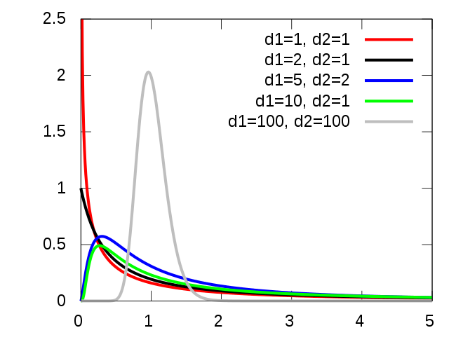

### Warmup

.large[
Work on the warmup activity (handout), then we will discuss as a class.
]

---

### Warmup

.large[
```
Coefficients:
            Estimate Std. Error t value Pr(>|t|)  
(Intercept)  1.80642    1.93822   0.932   0.3520  
Depth        0.06889    0.03001   2.296   0.0223 *
```

```
           Df  Sum Sq Mean Sq F value  Pr(>F)  
Depth       1   43.66  43.657  5.2711 0.02227 *
Residuals 349 2890.53   8.282                  
```

.question[
How do the p-values and test statistics relate?
]
]

---

### t-tests and F-tests


.large[
```
Coefficients:
            Estimate Std. Error t value Pr(>|t|)  
(Intercept)  1.80642    1.93822   0.932   0.3520  
Depth        0.06889    0.03001   2.296   0.0223 *
```

```
           Df  Sum Sq Mean Sq F value  Pr(>F)  
Depth       1   43.66  43.657  5.2711 0.02227 *
Residuals 349 2890.53   8.282                  
```

For the simple linear regression model

$$Y = \beta_0 + \beta_1 X + \varepsilon$$
consider testing $H_0: \beta_1 = 0$ vs. $H_A: \beta_1 \neq 0$.

* $t^2 = F$
* p-values are the same for a t-test and an F-test
]


---

### Previously

```{r echo=F, message=F, warning=F}
library(palmerpenguins)
library(tidyverse)
library(latex2exp)
library(Stat2Data)

penguins_no_nas <- penguins %>%
  drop_na()
```

.large[
More evidence for a relationship when *between-group* variability is larger than *within-group* variability.
]

.pull-left[
```{r echo=F, message=F, warning=F, fig.align='center', fig.width=6, fig.height=4}
penguins_no_nas %>%
  mutate(bill_length_mm = bill_length_mm + 
           ifelse(species == "Adelie", 0, 
                  ifelse(species == "Chinstrap", 10, 5))) %>%
  ggplot(aes(x = species, y = bill_length_mm)) +
  geom_boxplot(lwd=1) +
  theme_classic() +
  labs(x = "Species", 
       y = "Bill length (mm)") +
  theme(text = element_text(size = 25),
        axis.text.y = element_blank())
```

.large[
Large between-group variability, relative to within-group variability.
]
]

.pull-right[
```{r echo=F, message=F, warning=F, fig.align='center', fig.width=6, fig.height=4}
penguins_no_nas %>%
  mutate(bill_length_mm = bill_length_mm + 
           rnorm(nrow(penguins_no_nas), sd=20)) %>%
  ggplot(aes(x = species, y = bill_length_mm)) +
  geom_boxplot(lwd=1) +
  theme_classic() +
  labs(x = "Species", 
       y = "Bill length (mm)") +
  theme(text = element_text(size = 25),
        axis.text.y = element_blank())
```

.large[
Small between-group variability, relative to within-group variability.
]
]


---

### Analysis of variance

.large[

**Test statistic:** $F = \dfrac{\frac{1}{p-1} \sum \limits_{i=1}^n (\widehat{y}_i - \overline{y})^2}{\frac{1}{n-p} \sum \limits_{i=1}^n (y_i - \widehat{y}_i)^2} = \dfrac{\frac{1}{p-1} SSModel}{\frac{1}{n-p} SSE} = \dfrac{MSModel}{MSE}$ 

**Analysis of variance (ANOVA) table:**

| Source | df | SS | MS | F |
| --- | --- | --- | --- | --- |
| Model | $p-1$ | $SSModel$ | $MSModel = \frac{SSModel}{p-1}$ | $F = \frac{MSModel}{MSE}$ |
| Residual | $n - p$ | $SSE$ | $MSE = \frac{SSE}{n-p}$ | |
| Total | $n-1$ | $SSTotal$ | | |
]

---

### Test statistic

```{r echo=F, message=F, warning=F, fig.align='center', fig.width=7, fig.height=4}
penguins_no_nas %>%
  ggplot(aes(x = species, y = bill_length_mm)) +
  geom_boxplot(lwd=1.5) +
  theme_classic() +
  labs(x = "Species", 
       y = "Bill length (mm)") +
  theme(text = element_text(size = 25))
```

.large[
**Test statistic:** $F = \dfrac{\text{between group variance}}{\text{within group variance}} = 397.3$

.question[
Are large or small values of $F$ evidence against $H_0$?
]
]

---

### $F$ distribution

.large[
If $H_0$ is true, then $F = \dfrac{MSModel}{MSE}$ follows an $F_{p-1, \ n-p}$ distribution.

Some $F_{d_1, \ d_2}$ distributions:
]

.center[

]

---

### Calculating p-values

.large[
**Test statistic:** $F = 397.3$

**Degrees of freedom:** $p - 1 = 2$, $n - p = 330$

$F_{2, \ 330}$ distribution:

```{r echo=F, message=F, warning=F, fig.align='center', fig.width=6, fig.height=3.5}
data.frame(x = seq(0, 10, 0.1),
           y = df(seq(0, 10, 0.1), 2, 330)) %>%
  ggplot(aes(x = x, y = y)) +
  geom_line(lwd = 1.5) +
  labs(x = "", y = "density") +
  theme_bw() +
  theme(text = element_text(size = 25))
```

**p-value** =  $P(F_{2, \ 330} > 397.3) \approx 0$
]

---

### Summary

.large[
**Model:** $\text{bill length} = \beta_0 + \beta_1 \text{IsChinstrap} + \beta_2 \text{IsGentoo} + \varepsilon$

**Hypotheses:** 

$H_0: \beta_1 = \beta_2 = 0$ 

$H_A: \text{ at least one of } \beta_1, \beta_2 \neq 0$

**Test statistic:** $F = 397.3$

**p-value** $\approx 0$

**Conclusion:** We have strong evidence that there is a relationship between species and bill length.
]

---

### In R

```{r include=F}
species_lm <- lm(bill_length_mm ~ species, data = penguins_no_nas)
```

.large[
```{r}
anova(species_lm)
```

| Source | df | SS | MS | F |
| --- | --- | --- | --- | --- |
| Model | 2 | 7015.4 | 3507.7 | 397.3 |
| Residual | 330 | 2913.5 | 8.8 | |
| Total | 332  | 9928.9 | | |

]

---

### Class activity

.large[
* For the remainder of class, work on the class activity 
    * Regression, diagnostics, and inference with the diamonds data
* Submit rendered HTML on Canvas when finished
]


