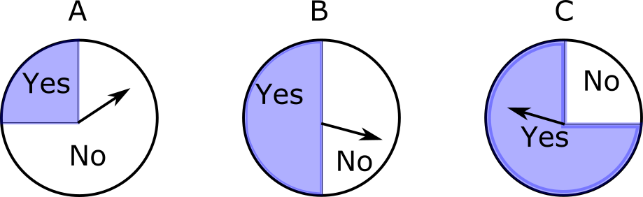

### Last time: Class activity

.large[
$\pi = P(Accepted = 1)$

$\log \left( \dfrac{\widehat{\pi}}{1 - \widehat{\pi}} \right) = -8.712 + 0.246 \ \text{MCAT}$ 

.question[
What is the change in the odds of acceptance associated with an increase of 1 point on the MCAT?
]
]

---

### Class activity

.large[
$\pi = P(Accepted = 1)$

$\log \left( \dfrac{\widehat{\pi}}{1 - \widehat{\pi}} \right) = -8.712 + 0.246 \ \text{MCAT}$ 

.question[
What is the estimated probability that a student with an MCAT score of 40 is accepted?
]
]

---

### Class activity

.large[
$\pi = P(Accepted = 1)$

$\log \left( \dfrac{\widehat{\pi}}{1 - \widehat{\pi}} \right) = -8.712 + 0.246 \ \text{MCAT}$ 

.question[
For approximately what MCAT score would a student have a roughly 50-50 chance of being accepted to medical school?
]
]

---

### Warmup

.large[
Work on the warmup activity (handout).
]

---

### Warmup

.center[

$\pi = P(Yes) = \dfrac{1}{4} \hspace{3cm} \pi = \dfrac{1}{2} \hspace{4cm} \pi = \dfrac{3}{4} \hspace{1cm}$
]

.large[
A spinner is chosen and spun twice, resulting in No, No. 

* $P(\text{No, No})$ if $\pi = \dfrac{1}{4}$:
* $P(\text{No, No})$ if $\pi = \dfrac{1}{2}$:
* $P(\text{No, No})$ if $\pi = \dfrac{3}{4}$:
]

---

### Warmup

.center[

$\pi = P(Yes) = \dfrac{1}{4} \hspace{3cm} \pi = \dfrac{1}{2} \hspace{4cm} \pi = \dfrac{3}{4} \hspace{1cm}$
]

.large[
A spinner is chosen and spun twice, resulting in No, No. 

* $P(\text{No, No})$ if $\pi = \dfrac{1}{4}$: $\left( \dfrac{3}{4} \right) \left( \dfrac{3}{4} \right) = \dfrac{9}{16}$
* $P(\text{No, No})$ if $\pi = \dfrac{1}{2}$: 
* $P(\text{No, No})$ if $\pi = \dfrac{3}{4}$: 
]

---

### Warmup

.center[

$\pi = P(Yes) = \dfrac{1}{4} \hspace{3cm} \pi = \dfrac{1}{2} \hspace{4cm} \pi = \dfrac{3}{4} \hspace{1cm}$
]

.large[
A spinner is chosen and spun twice, resulting in No, No. 

* $P(\text{No, No})$ if $\pi = \dfrac{1}{4}$: $\left( \dfrac{3}{4} \right) \left( \dfrac{3}{4} \right) = \dfrac{9}{16}$
* $P(\text{No, No})$ if $\pi = \dfrac{1}{2}$: $\left( \dfrac{1}{2} \right) \left( \dfrac{1}{2} \right) = \dfrac{4}{16}$
* $P(\text{No, No})$ if $\pi = \dfrac{3}{4}$:
]

---

### Warmup

.center[

$\pi = P(Yes) = \dfrac{1}{4} \hspace{3cm} \pi = \dfrac{1}{2} \hspace{4cm} \pi = \dfrac{3}{4} \hspace{1cm}$
]

.large[
A spinner is chosen and spun twice, resulting in No, No. 

* $P(\text{No, No})$ if $\pi = \dfrac{1}{4}$: $\left( \dfrac{3}{4} \right) \left( \dfrac{3}{4} \right) = \dfrac{9}{16}$
* $P(\text{No, No})$ if $\pi = \dfrac{1}{2}$: $\left( \dfrac{1}{2} \right) \left( \dfrac{1}{2} \right) = \dfrac{4}{16}$
* $P(\text{No, No})$ if $\pi = \dfrac{3}{4}$: $\left( \dfrac{1}{4} \right) \left( \dfrac{1}{4} \right) = \dfrac{1}{16}$
]

---

### Warmup

.large[
A spinner is chosen and spun twice, resulting in No, No. 

* $P(\text{No, No})$ if $\pi = \dfrac{1}{4}$: $\left( \dfrac{3}{4} \right) \left( \dfrac{3}{4} \right) = \dfrac{9}{16}$
* $P(\text{No, No})$ if $\pi = \dfrac{1}{2}$: $\left( \dfrac{1}{2} \right) \left( \dfrac{1}{2} \right) = \dfrac{4}{16}$
* $P(\text{No, No})$ if $\pi = \dfrac{3}{4}$: $\left( \dfrac{1}{4} \right) \left( \dfrac{1}{4} \right) = \dfrac{1}{16}$

Which spinner would you guess was spun?
]

---

### Warmup

.large[
A spinner is chosen and spun twice, resulting in No, No. 

* $P(\text{No, No})$ if $\pi = \dfrac{1}{4}$: $\left( \dfrac{3}{4} \right) \left( \dfrac{3}{4} \right) = \dfrac{9}{16}$
* $P(\text{No, No})$ if $\pi = \dfrac{1}{2}$: $\left( \dfrac{1}{2} \right) \left( \dfrac{1}{2} \right) = \dfrac{4}{16}$
* $P(\text{No, No})$ if $\pi = \dfrac{3}{4}$: $\left( \dfrac{1}{4} \right) \left( \dfrac{1}{4} \right) = \dfrac{1}{16}$

Which spinner would you guess was spun? **Spinner A, because the probability of the observed data is the highest**
]

---

### Warmup

.large[
A spinner is chosen and spun four times, resulting in No, Yes, Yes, No. 

* $P(\text{No, Yes, Yes, No})$ if $\pi = \dfrac{1}{4}$: 
* $P(\text{No, Yes, Yes, No})$ if $\pi = \dfrac{1}{2}$:
* $P(\text{No, Yes, Yes, No})$ if $\pi = \dfrac{3}{4}$:
]

---

### Warmup

.large[
A spinner is chosen and spun four times, resulting in No, Yes, Yes, No. 

* $P(\text{No, Yes, Yes, No})$ if $\pi = \dfrac{1}{4}$: $\dfrac{9}{256}$
* $P(\text{No, Yes, Yes, No})$ if $\pi = \dfrac{1}{2}$: $\dfrac{16}{256}$
* $P(\text{No, Yes, Yes, No})$ if $\pi = \dfrac{3}{4}$: $\dfrac{9}{256}$

Which spinner would you guess was spun? 
]

---

### Warmup

.large[
A spinner is chosen and spun four times, resulting in No, Yes, Yes, No. 

* $P(\text{No, Yes, Yes, No})$ if $\pi = \dfrac{1}{4}$: $\dfrac{9}{256}$
* $P(\text{No, Yes, Yes, No})$ if $\pi = \dfrac{1}{2}$: $\dfrac{16}{256}$
* $P(\text{No, Yes, Yes, No})$ if $\pi = \dfrac{3}{4}$: $\dfrac{9}{256}$

Which spinner would you guess was spun? **Spinner B, because the probability of the observed data is the highest**
]

---

### Likelihood

.large[
**Likelihood:** the probability of the observed data, regarded as a function of the parameters
]

.center[

$\pi = P(Yes) = \dfrac{1}{4} \hspace{3cm} \pi = \dfrac{1}{2} \hspace{4cm} \pi = \dfrac{3}{4} \hspace{1cm}$
]

.large[
| $\pi =$ parameter value | $\dfrac{1}{4}$ | $\dfrac{1}{2}$ | $\dfrac{3}{4}$ |
| --- | --- | --- | --- |
| $P(\text{No, No}) = \text{likelihood} = L(\pi)$ | $\dfrac{9}{16}$ | $\dfrac{4}{16}$ | $\dfrac{1}{16}$ |
]

---

### Maximum likelihood

.large[
**Maximum likelihood principle:** estimate the parameters to be the values that maximize the likelihood

| $\pi =$ parameter value | $\dfrac{1}{4}$ | $\dfrac{1}{2}$ | $\dfrac{3}{4}$ |
| --- | --- | --- | --- |
| $P(\text{No, No}) = \text{likelihood} = L(\pi)$ | $\dfrac{9}{16}$ | $\dfrac{4}{16}$ | $\dfrac{1}{16}$ |

Maximum likelihood estimate: $\widehat{\pi} = \dfrac{1}{4}$
]

---

### Maximum likelihood

.large[
**Maximum likelihood principle:** estimate the parameters to be the values that maximize the likelihood

Steps for maximum likelihood estimation:

* *Likelihood:* For each value of the parameter, compute the probability of the observed data, $P(\text{data})$
* *Maximize:* Find the parameter value that gives the largest $P(\text{data})$
]

---

### Maximum likelihood for logistic regression 

.large[
**Putting data:** Putt at lengths 3, 4, 5, 6, and 7 feet. Record whether you make the put ( $y = 1$ ) or miss ( $y = 0$ ). Let $\pi = P(y = 1)$.

**Regression model:** $\log \left( \dfrac{\pi}{1 - \pi} \right) = \beta_0 + \beta_1 \ \text{length} \hspace{1cm} \pi = \dfrac{\exp\{\beta_0 + \beta_1 \ \text{length}\}}{1 + \exp\{\beta_0 + \beta_1 \ \text{length}\}}$

**Observed data:** (length = 3, make), (length = 3, make), (length = 4, make), (length = 5, miss), (length = 7, miss)
]

---

### Maximum likelihood for logistic regression 

.large[
**Putting data:** Putt at lengths 3, 4, 5, 6, and 7 feet. Record whether you make the put ( $y = 1$ ) or miss ( $y = 0$ ). Let $\pi = P(y = 1)$.

**Regression model:** $\log \left( \dfrac{\pi}{1 - \pi} \right) = \beta_0 + \beta_1 \ \text{length} \hspace{1cm} \pi = \dfrac{\exp\{\beta_0 + \beta_1 \ \text{length}\}}{1 + \exp\{\beta_0 + \beta_1 \ \text{length}\}}$

**Observed data:** (length = 3, make), (length = 3, make), (length = 4, make), (length = 5, miss), (length = 7, miss)
]

.large[
Suppose $\beta_0 = 3, \ \beta_1 = -0.5$. What is $P(\text{data})$ (aka $L(\beta_0, \beta_1)$)?
]

---

### Maximum likelihood for logistic regression 

.large[
**Regression model:** $\log \left( \dfrac{\pi}{1 - \pi} \right) = \beta_0 + \beta_1 \ \text{length} \hspace{1cm} \pi = \dfrac{\exp\{\beta_0 + \beta_1 \ \text{length}\}}{1 + \exp\{\beta_0 + \beta_1 \ \text{length}\}}$

**Observed data:** (length = 3, make), (length = 3, make), (length = 4, make), (length = 5, miss), (length = 7, miss)

Suppose $\beta_0 = 3, \ \beta_1 = -0.5$. What is $P(\text{data})$ (aka $L(\beta_0, \beta_1)$)?

| Length | 3 | 4 | 5 | 6 | 7 |
| --- | --- | --- | --- | --- | --- |
| $\pi$ | $\dfrac{\exp\{3 - 0.5(3)\}}{1 + \exp\{3 - 0.5(3)\}} = 0.818$ | 0.731 | 0.622 | 0.5 | 0.378 |
]

---

### Maximum likelihood for logistic regression 

.large[
**Regression model:** $\log \left( \dfrac{\pi}{1 - \pi} \right) = \beta_0 + \beta_1 \ \text{length} \hspace{1cm} \pi = \dfrac{\exp\{\beta_0 + \beta_1 \ \text{length}\}}{1 + \exp\{\beta_0 + \beta_1 \ \text{length}\}}$

**Observed data:** (length = 3, make), (length = 3, make), (length = 4, make), (length = 5, miss), (length = 7, miss)

Suppose $\beta_0 = 3, \ \beta_1 = -0.5$. What is $P(\text{data})$ (aka $L(\beta_0, \beta_1)$)?

| Length | 3 | 4 | 5 | 6 | 7 |
| --- | --- | --- | --- | --- | --- |
| $\pi$ | $\dfrac{\exp\{3 - 0.5(3)\}}{1 + \exp\{3 - 0.5(3)\}} = 0.818$ | 0.731 | 0.622 | 0.5 | 0.378 |
]

.large[
$L(\beta_0, \beta_1) = P(\text{data}) = \\ \hspace{1cm} (0.818)(0.818)(0.731)(1 - 0.622)(1 - 0.378) = 0.115$
]

---

### Class activity

.large[
Work on the class activity (handout). 
]

---

### Class activity

.large[
| Length | 3 | 4 | 5 | 6 | 7 |
| --- | --- | --- | --- | --- | --- |
| Number of successes | 3 | 2 | 3 | 1 | 1 |
| Number of failures | 0 | 0 | 2 | 1 | 2 |

What's the probability of the observed data, if $\beta_0 = 3$ and $\beta_1 = -0.5$?
]

---

### Class activity

.large[
| Length | 3 | 4 | 5 | 6 | 7 |
| --- | --- | --- | --- | --- | --- |
| Number of successes | 3 | 2 | 3 | 1 | 1 |
| Number of failures | 0 | 0 | 2 | 1 | 2 |

| Length | 3 | 4 | 5 | 6 | 7 |
| --- | --- | --- | --- | --- | --- |
| $\pi$ | $\dfrac{\exp\{3 - 0.5(3)\}}{1 + \exp\{3 - 0.5(3)\}} = 0.818$ | 0.731 | 0.622 | 0.5 | 0.378 |

$L(\beta_0, \beta_1) = P(\text{data}) =$
$$(0.818)^3(0.731)^2(0.622)^3(1 - 0.622)^2(0.5)(1 - 0.5) \\ \cdot (0.378)(1 - 0.378)^2$$
$= 0.000368$
]

---

### Class activity

.large[
| Length | 3 | 4 | 5 | 6 | 7 |
| --- | --- | --- | --- | --- | --- |
| Number of successes | 3 | 2 | 3 | 1 | 1 |
| Number of failures | 0 | 0 | 2 | 1 | 2 |

What's the probability of the observed data, if $\beta_0 = 4$ and $\beta_1 = -0.75$?
]

---

### Class activity

.large[
| Length | 3 | 4 | 5 | 6 | 7 |
| --- | --- | --- | --- | --- | --- |
| Number of successes | 3 | 2 | 3 | 1 | 1 |
| Number of failures | 0 | 0 | 2 | 1 | 2 |

| Length | 3 | 4 | 5 | 6 | 7 |
| --- | --- | --- | --- | --- | --- |
| $\pi$ | $\dfrac{\exp\{4 - 0.75(3)\}}{1 + \exp\{4 - 0.75(3)\}} = 0.852$ | 0.731 | 0.562 | 0.378 | 0.223 |

$L(\beta_0, \beta_1) = P(\text{data}) =$
$$(0.852)^3(0.731)^2(0.562)^3(1 - 0.562)^2(0.378)(1 - 0.378) \\ \cdot (0.223)(1 - 0.223)^2$$
$= 0.000356$
]

---

### Maximum likelihood for logistic regression

.large[
**Likelihood:** 
* For estimates $\widehat{\beta}_0$ and $\widehat{\beta}_1$, $\widehat{\pi} = \dfrac{\exp\{\widehat{\beta}_0 + \widehat{\beta}_1 x\}}{1 + \exp\{\widehat{\beta}_0 + \widehat{\beta}_1 x\}}$
* $L(\widehat{\beta}_0, \widehat{\beta}_1) = P(\text{data})$
    
**Maximize:** 
* Choose $\widehat{\beta}_0$, $\widehat{\beta}_1$ to maximize $L(\widehat{\beta}_0, \widehat{\beta}_1)$
    
.question[
In the class activity examples, we have only considered a few different possibilities for $\widehat{\beta}_0$ and $\widehat{\beta}_1$. In reality, we consider all real numbers as possible values.
]
]

---

### Fitting logistic regression

.large[
.pull-left[
**Logistic regression with maximum likelihood**

* **Model:** $\log \left( \dfrac{\pi}{1 - \pi} \right) = \beta_0 + \beta_1 x$
* **Measure of fit:** $L(\widehat{\beta}_0, \widehat{\beta}_1) =$ probability of observed data for estimates $\widehat{\beta}_0$, $\widehat{\beta}_1$
* **Optimize:** choose $\widehat{\beta}_0$, $\widehat{\beta}_1$ to maximize $L(\widehat{\beta}_0, \widehat{\beta}_1)$
]

.pull-right[
**Linear regression with least squares**

 

* **Model:** $y = \beta_0 + \beta_1 x + \varepsilon$
* **Measure of fit:** $SSE = \sum \limits_{i = 1}^n (y_i - \widehat{\beta}_0 - \widehat{\beta}_1 x_i)^2$
* **Optimize:** choose $\widehat{\beta}_0$, $\widehat{\beta}_1$ to minimize SSE
]
]